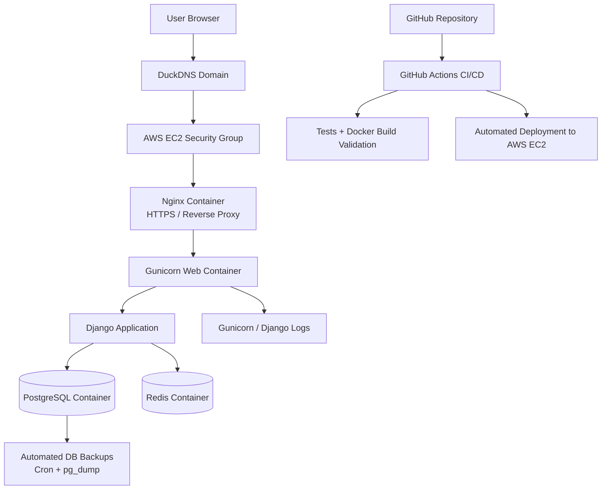

# BranchRoute Platform

A production-deployed supporter operations platform for branches, ticketing, transport, and match-day engagement, built with Django, PostgreSQL, Redis, Docker, AWS EC2, Nginx, HTTPS, and GitHub Actions CI/CD.

This project demonstrates end-to-end software delivery, covering backend development, containerization, cloud deployment, production operations, infrastructure management, and automated deployment pipelines.

---

## Project Overview

BranchRoute is a supporter operations platform that allows branches and supporters to:

- Register and belong to a branch
- Manage membership status
- View matches
- Book match tickets
- Generate and verify ticket QR codes
- Book transport linked to match tickets
- Verify transport boarding
- Handle membership payment activation flows

The project also includes production-style infrastructure using Docker, Nginx, Gunicorn, PostgreSQL, Redis, health checks, logging, automated backups, and AWS EC2 deployment.

---

## Live Environment

Production URL:

https://sundownswpa.duckdns.org

The application is deployed on AWS EC2 behind Nginx with HTTPS enabled through Let's Encrypt SSL certificates.

Production stack:

- AWS EC2
- Docker & Docker Compose
- Nginx Reverse Proxy
- Gunicorn Application Server
- PostgreSQL Database
- Redis
- GitHub Actions CI/CD
- DuckDNS
- Let's Encrypt

---

## Tech Stack

### Backend

- Python
- Django
- Django REST Framework
- JWT authentication
- PostgreSQL
- Redis
- Celery foundation

### Frontend

- Django Templates
- Tailwind CSS

### DevOps & Infrastructure

- Docker
- Docker Compose
- Nginx reverse proxy
- Gunicorn application server
- GitHub Actions CI/CD
- AWS EC2
- Linux server administration
- Cron-based database backups
- Health checks
- Production logging

---

## Key Features

- User registration and authentication
- Branch assignment during registration
- Membership management with centralized tier rule support for future points, rewards, promotions, and merchandise benefits
- Membership activation through payment flow
- Match listing
- Ticket booking
- QR code ticket generation
- Admin-only ticket verification
- Transport booking after ticket booking
- Transport boarding verification using ticket QR code
- Branch overview with supporter count
- Production health endpoint
- Dockerized development and production runtime

---

## Architecture

```text
Browser
→ Nginx
→ Gunicorn
→ Django
→ PostgreSQL
→ Redis
```

### Container Services

```text
nginx   → reverse proxy and static/media serving
web     → Django application running through Gunicorn
db      → PostgreSQL database
redis   → Redis broker/cache foundation
celery  → background worker foundation
```

---

## Development Environment

The development environment uses Docker Compose with:

* Django development server
* PostgreSQL container
* Redis container
* Celery container
* `.env.dev`
* `sundowns_app.settings.dev`

Run development stack:

```bash
docker compose up -d
```

Access app:

```text
http://127.0.0.1:8000/
```

---

## Production-Style Runtime

The production-style runtime uses:

* Nginx
* Gunicorn
* PostgreSQL
* Redis
* Docker Compose production override
* `.env.prod`
* `sundowns_app.settings.prod`

Run production-style stack:

```bash
docker-compose -f docker-compose.yml -f docker-compose.prod.yml up -d --build
```

Check containers:

```bash
docker-compose -f docker-compose.yml -f docker-compose.prod.yml ps
```

---

## Environment Variables

Real environment files are not committed to Git.

Use:

```text
.env.prod.example
```

as a template.

Required production variables include:

```env
DJANGO_SETTINGS_MODULE=sundowns_app.settings.prod
SECRET_KEY=
ALLOWED_HOSTS=
DB_NAME=
DB_USER=
DB_PASSWORD=
DB_HOST=
DB_PORT=
CELERY_BROKER_URL=
CELERY_RESULT_BACKEND=
```

---

## Health Check

The application includes a production health endpoint:

```text
/common/health/
```

Expected response:

```json
{
  "status": "healthy",
  "database": "connected"
}
```

This verifies that Django can respond and connect to the database.

Notes on endpoints:

- `/health/` — lightweight root health check (optional). Returns a simple `{"status": "ok"}` and is useful for external load-balancer or uptime probes that don't need DB verification.
- `/common/health/` — full application health check. Verifies Django startup and database connectivity; used by container or orchestration health probes.

---

## CI/CD

GitHub Actions is configured to:

- Install dependencies
- Start PostgreSQL and Redis services
- Run Django checks
- Run migrations
- Run automated tests
- Validate Docker image build
- Build and push Docker images
- Deploy to AWS EC2 via SSH
- Restart containers with updated images

Workflow file:

```text
.github/workflows/ci.yml
```

---

## Database Backups

The project includes a backup script:

```bash
scripts/backup_db.sh
```

Run manually:

```bash
./scripts/backup_db.sh
```

Backups are stored in:

```text
backups/
```

Backups are ignored by Git.

A cron job can be configured for automated daily backups.

---

## Logging and Observability

The project includes:

- Django console logging
- Gunicorn access logs
- Gunicorn error logs
- Docker container health checks
- Health endpoint monitoring
- Docker stats inspection

Logs are stored in:

```text
logs/
```

---

## Testing

Run tests locally:

```bash
python manage.py test --settings=sundowns_app.settings.test
```

Run tests inside Docker:

```bash
docker compose exec web python manage.py test --settings=sundowns_app.settings.test
```

---

## Deployment Status

Current deployment maturity:

- Local development environment ✅
- Production-style Docker runtime ✅
- Nginx reverse proxy configured ✅
- HTTPS with Let’s Encrypt ✅
- Domain-based deployment ✅
- Health checks configured ✅
- GitHub Actions CI/CD configured ✅
- AWS EC2 deployment complete ✅
- Elastic IP configured ✅
- Backup automation started ✅
- Logging and observability started ✅
- Transport workflow implemented ✅

---

## Future Improvements

### Infrastructure

- AWS S3 for media storage
- AWS RDS for managed PostgreSQL
- Managed Redis service
- Terraform infrastructure provisioning

### Monitoring

- Prometheus monitoring
- Grafana dashboards
- Centralized log aggregation
- Alerting and notifications

### Deployment

- Dedicated deployment user
- Deployment rollback strategy
- Staging environment automation
- Blue/Green deployment workflow

### Platform Features

- Celery production workloads
- Background notification processing
- Membership renewal automation
- Reporting dashboards

### Advanced DevOps

- Kubernetes deployment
- Helm charts
- GitOps with ArgoCD
- Infrastructure as Code

---

## Architecture Diagram



---

## DevOps Technologies Demonstrated

This project demonstrates practical experience with:

- Linux Administration
- Docker
- Docker Compose
- Nginx
- Gunicorn
- PostgreSQL
- Redis
- AWS EC2
- HTTPS/TLS
- DNS Management
- Git
- GitHub Actions
- CI/CD Pipelines
- Environment Management
- Production Troubleshooting
- Infrastructure Documentation
- Health Checks
- Backup Automation

---

## Author

William Mabelane

GitHub: https://github.com/Wilm12

Project Highlights:

- Production AWS Deployment
- Dockerized Infrastructure
- HTTPS with Let's Encrypt
- GitHub Actions CI/CD
- PostgreSQL & Redis
- Django REST Framework
- Linux Administration
- DevOps Practices
